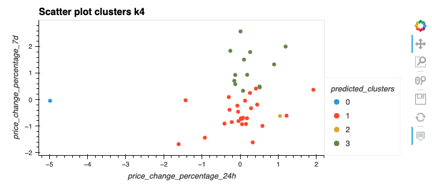
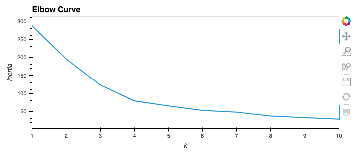
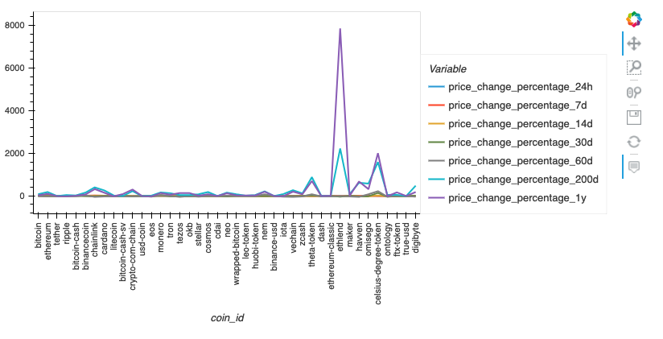
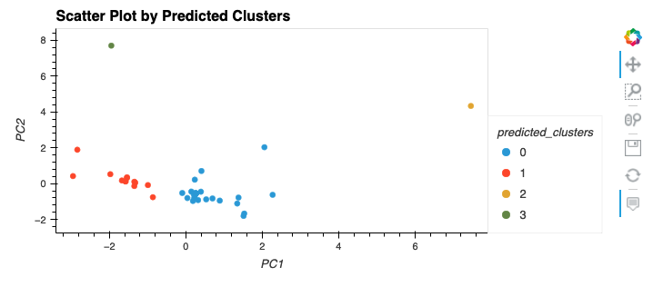
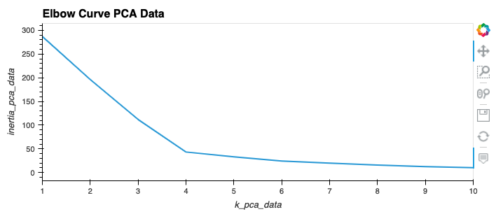

# Crypto Clustering
In this challange we’ll combine our financial Python programming skills with the new unsupervised learning skills that we acquired.

---
## Technologies

Crypto Clustering project leverages python 3.7 with the following packages:

  [Pandas](https://github.com/pandas-dev/pandas "Pandas") 
  
 --- 
  ## Installation Guide

First install the following libraries and dependencies.

```
# conda
conda install pandas
```
  [Hvplot](https://hvplot.holoviz.org/user_guide/Plotting.html "Hvplot") 
   
  [scikit-learn](https://scikit-learn.org/stable/user_guide.html "Scikit-learn") 

```
import pandas as pd
import hvplot.pandas
from path import Path
from sklearn.cluster import KMeans
from sklearn.decomposition import PCA
from sklearn.preprocessing import StandardScaler
```

---
## Usage

** **







---
## Contributors

* Brought to you by Olga Koryachek.
* Email: olgakoryachek@live.com
* [LinkedIn](https://www.linkedin.com/in/olga-koryachek-a74b1877/?msgOverlay=true "LinkedIn")

---
## License

Licensed under the [MIT License](https://choosealicense.com/licenses/mit/)
